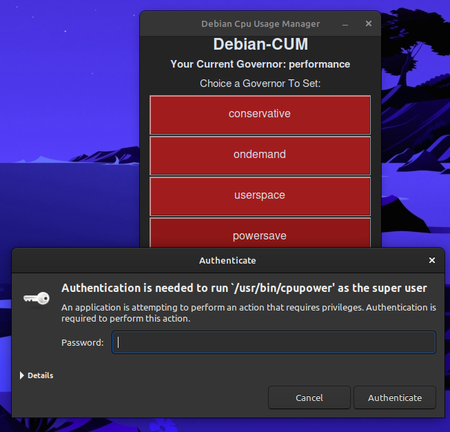

# 🧠 Debian-CUM (CPU Usage Manager)


**Debian-CUM** stands for **Debian CPU Usage Manager** 
a lightweight, dark-themed GUI tool that helps you view and change your CPU frequency governor on Debian-based systems.

> Built for simplicity and permanence — because your CPU deserves the right governor 😎


## 📸 Screenshot
Here's some shots of the application 
<div style='display: grid;'>
    
    
</div>

## ⚙️ Features

- Display available CPU frequency governors using `cpupower`
- Show current active governor
- Easily switch to another governor via a modern GUI
- Changes are made permanent using a `systemd` service
- Secure privilege escalation using `pkexec`
- Built with [`customtkinter`](https://github.com/TomSchimansky/CustomTkinter) for a sleek UI

## 🚀 Getting Started

### Prerequisites

- Python 3.8+
- `cpupower` installed (`sudo apt install linux-tools-common linux-tools-$(uname -r)`)
- `pkexec` available (via `policykit-1`)

### Run the application from source code:

```bash
git clone https://github.com/your-username/debian-cum.git
cd debian-cum
pip install -r requirements.txt
python3 main.py
```

## 🔐 Important Note About Privileges
In order to apply and persist the selected CPU governor, the app will prompt for your password three times using pkexec:

- To run cpupower frequency-set
- To move the generated .service file into /etc/systemd/system
- To enable the new service using systemctl enable

This ensures the operation is secure and avoids running the whole app with elevated privileges.

# ❤️ Built for Linux users.
